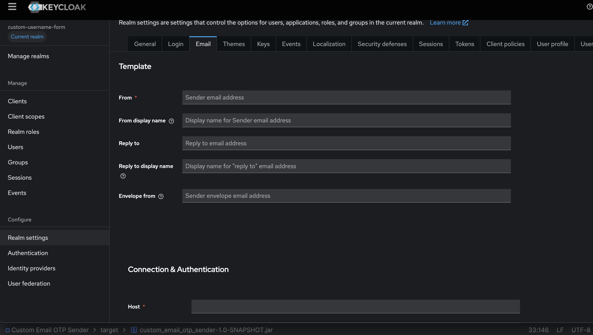

# Custom Email OTP Authenticator for Keycloak

This custom authenticator allows OTP (One-Time Password) authentication via email for Keycloak users. It uses SMTP to send OTPs to the user's email address, and validates the OTP entered by the user.

## Configuration

### 1. Set up SMTP Configuration

To configure this authenticator, you need to provide SMTP credentials to send emails. These credentials should be added to the **Authenticator Configuration**:

1. Navigate to the **Keycloak Admin Console**.
2. Under **Realm Setting**, go to the **Email** tag.
3. Configure the following:



Follow these steps:

1. Navigate to the **Keycloak Admin Console**.
2. Under **Authentication**, create or edit an existing flow.
3. Add the **Custom Email OTP Authenticator** to the flow.

### 2. Email Validation

The **CustomEmailOtpAuthenticator** validates the email address provided by the user before sending the OTP. It uses a regular expression to ensure that the email is in a valid format.

---

## Usage

### Authentication Flow

1. The user enters their **email address** in the login form.(Login form must pass **email** field to work this flow else skip email sending flow)
2. The **Custom Email OTP Authenticator** validates the email and generates an OTP.
3. The OTP is sent to the user's email via SMTP.
4. The user is presented with an OTP input form to enter the OTP they received in their email.
5. The user submits the OTP for validation:
    - If the OTP is valid, authentication is successful.
    - If the OTP is invalid, the user is prompted again.

### OTP Input Form

The user is prompted to enter the OTP they received via email in the form displayed by the authenticator.

---

## Components

### 1. **CustomEmailOtpAuthenticator**

This is the main class implementing the `Authenticator` interface. It performs the following tasks:
- Validates the email address.
- Generates and stores the OTP.
- Sends the OTP via email using **SMTP**.
- Displays an OTP input form for the user to enter their OTP.

### 2. **EmailSenderService**

The `EmailSenderService` class handles the OTP generation, validation, and email sending:
- Generates a random 6-digit OTP.
- Sends the OTP via email using **SMTP**.
- Validates the OTP provided by the user.
- Stores OTPs temporarily for validation.

### 3. **CustomEmailOtpAuthenticatorFactory**

This factory class configures the **CustomEmailOtpAuthenticator** and its settings in the **Keycloak Admin Console**:
- Displays the authenticator name (`Email OTP Sender`).
- Provides configuration properties for the **SMTP credentials**.

---

## Example: OTP Input Form

Here is the HTML form displayed to the user where they will enter their OTP:

```html
<@layout.registrationLayout displayMessage=true; section>
  <form action="${url.loginAction}" method="post">
    <div class="form-group">
      <label for="otp">Enter OTP</label>
      <input type="text" id="otp" name="otp" class="form-control" autofocus />
    </div>
    <div class="form-group">
      <button type="submit" class="btn btn-primary">Verify</button>
    </div>
  </form>
</@layout.registrationLayout>
```

### Notes:
1. **Customization**: You can customize  the logic based on your requirements.
2. **Keycloak Integration**: Make sure you understand how to deploy and configure Keycloak with custom SPIs. You may need to restart your Keycloak instance after deploying the JAR.
