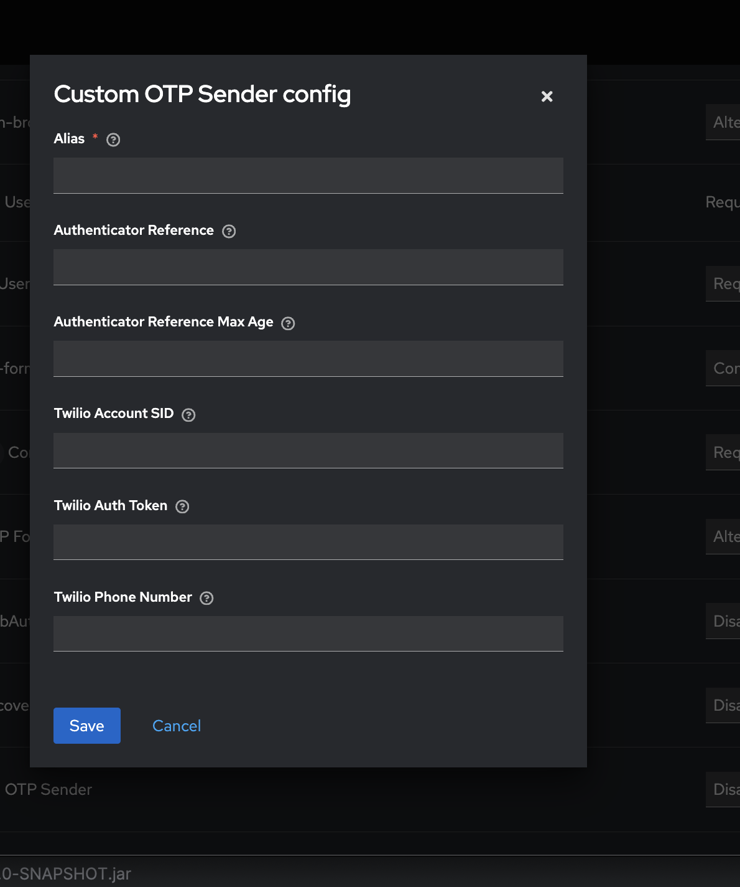

# Custom SMS OTP Authenticator for Keycloak

This custom authenticator allows OTP (One-Time Password) authentication via **SMS** for Keycloak users. It uses **Twilio** as the SMS provider to send OTPs, and validates the OTP entered by the user.

---

## Configuration

### 1. Set up Twilio Credentials

To configure this authenticator, you must provide your **Twilio** credentials:



- **Twilio Account SID**: The SID from your Twilio account.
- **Twilio Auth Token**: The authentication token from your Twilio account.
- **Twilio Phone Number**: The sender phone number from which the OTP will be sent.

Steps:

1. Navigate to the **Keycloak Admin Console**.
2. Under **Authentication**, create or edit an existing flow.
3. Add the **Custom SMS OTP Authenticator** (`Custom OTP Sender`) to the flow.
4. In the **Authenticator Configurations** tab, provide your **Twilio SID**, **Auth Token**, and **Phone Number**.

---

### 2. Phone Number Validation

The **CustomSmsOtpAuthenticator** validates the phone number before sending an OTP.  
It uses the regex:

```
+?[0-9]{7,15}
```


This ensures that the number is in an international format (e.g., `+11234567890`).

---

### 3. OTP Generation and SMS Sending

- A random numeric OTP is generated (length configurable).
- The OTP is stored in the authentication session with an expiry time.
- The OTP is sent to the user’s phone number via **Twilio SMS**.
- OTP attempts are tracked and limited by configuration.

---

## Usage

### Authentication Flow

1. The user enters their **phone number** in the login form.  
   *(The login form must include the field `phone` for this to work.)*
2. The **Custom SMS OTP Authenticator** validates the phone number.
3. The authenticator generates and stores an OTP.
4. The OTP is sent to the user’s phone via **Twilio**.
5. The user is presented with an OTP input form to enter the code.
6. The user submits the OTP:
   -  If valid → authentication succeeds.
   -  If invalid → user is prompted again until max attempts are reached.
   - If expired → user must request a new OTP.

---

## Components

### 1. **CustomSmsOtpAuthenticator**

Main class implementing the `Authenticator` interface:
- Validates phone number.
- Generates and stores OTP.
- Sends OTP via Twilio.
- Displays an OTP input form for user input.
- Validates OTP with expiry & attempt checks.

### 2. **OTPService**

Handles SMS operations:
- Sends OTP via Twilio API.
- Uses provided Twilio SID, Auth Token, and Phone Number.
- Wraps SMS sending logic separate from the authenticator.

### 3. **CustomSmsOtpAuthenticatorFactory**

Registers the authenticator in Keycloak:
- Display name: `Custom OTP Sender`.
- Provides configuration options:
   - **Twilio Account SID**
   - **Twilio Auth Token**
   - **Twilio Phone Number**
   - **Otp Length**
   - **Otp Expired (minutes)**
   - **Max Attempt**

---

## Twilio Setup

1. From the **Dashboard**, copy your **Account SID** and **Auth Token**.
2. Purchase a **Twilio phone number** for sending SMS.
3. Use these values in the **Authenticator Configuration** inside Keycloak.

---

## Example: OTP Input Form

Here is the FreeMarker template (`otp-input.ftl`) displayed to the user:

```html
<@layout.registrationLayout displayMessage=true; section>
  <form action="${url.loginAction}" method="post">
    <div class="form-group">
      <label for="otp">Enter OTP</label>
      <input type="text" id="otp" name="otp" class="form-control" autofocus />
    </div>
    <div class="form-group">
      <button type="submit" class="btn btn-primary">Verify</button>
    </div>
  </form>
</@layout.registrationLayout>
```

### Notes:
1. **Customization**: You can customize  the logic based on your requirements.
2. **Keycloak Integration**: Make sure you understand how to deploy and configure Keycloak with custom SPIs. You may need to restart your Keycloak instance after deploying the JAR.
