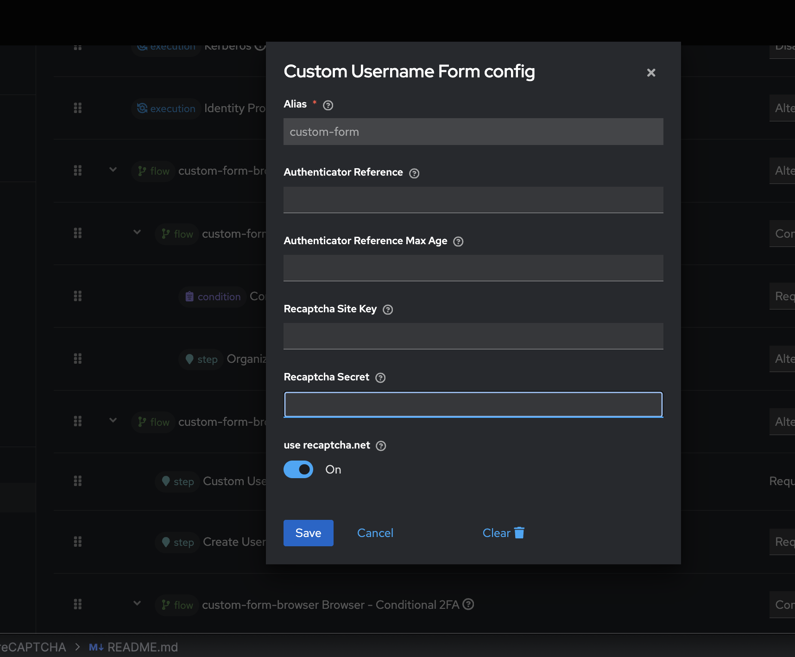

# Custom Username Form (Create User if not exist form) with reCAPTCHA for Keycloak

## Overview

This Keycloak authenticator integrates a custom username (create user if not exist) form with **Google reCAPTCHA** validation. The form collects the username without validating if the user exists in the system. Additionally, the reCAPTCHA ensures bot protection during the username submission process.

## Features
- **Username Form**: Collects the username for authentication or user creation purpose.
- **Google reCAPTCHA Integration**: Protects the form from automated submissions.
- **Customizable Configuration**: You can configure the **reCAPTCHA Site Key** and **Secret**.

## Components

This project consists of the following components:
1. **CustomUsernameForm**: The custom form authenticator for collecting the username(create user if not exist) and validating the reCAPTCHA response(not check for dev env if you want to check reCAPTCHA in dev env you can remove validation code in CustomUsernameForm). 
2. **CustomUsernameFormFactory**: The factory to configure and initialize the **CustomUsernameForm** authenticator.
3. **RecaptchaUtils**: Utility class to handle the reCAPTCHA verification and related operations.

## Installation

### 1. Clone the Repository

```bash
    git clone https://github.com/your-repo/custom-username-form-recaptcha.git
    cd custom-username-form-recaptcha
```

### 2. Build the JAR
Use Maven or Gradle to build the project. For Maven:
```bash
mvn clean install
```
### 3. **Deploy to Keycloak:**
   Copy the generated JAR file into the /providers directory of your Keycloak server.
### 4. **Restart Keycloak**:
   Restart your Keycloak server to load the new SPI.
```bash
    ./kc.sh build
    ./kc.sh start-dev
   ```

# Custom Username Form with reCAPTCHA for Keycloak

## Configuration

### 1. Create an Authentication Flow

1. In the **Keycloak Admin Console**, navigate to **Authentication**.
2. Create a new flow or edit an existing one.
3. Add the **Custom Username Form** authenticator to the flow.

### 2. Configure reCAPTCHA

- **Recaptcha Site Key**: The public key for your reCAPTCHA instance (configured in Google reCAPTCHA console).
- **Recaptcha Secret**: The secret key used for reCAPTCHA validation (configured in Google reCAPTCHA console).
- **Use reCAPTCHA.net**: Boolean to specify whether to use `recaptcha.net` (for non-Google servers) or `google.com` for reCAPTCHA.
  


To configure these properties:

1. Navigate to the **Authenticator Configurations** tab.
2. Set the **Recaptcha Site Key**, **Secret**, and **Use reCAPTCHA.net** options.

---

## Usage

### Authentication Flow

1. The user provides their **username** (which can be an **email**, **phone number**, or **normal username**).
2. The **Custom Username Form** authenticator displays a form to collect the username along with a reCAPTCHA widget.
3. The user submits the form. The **reCAPTCHA** response is validated, and the system checks if the username is valid.
4. If the **username** is valid and **reCAPTCHA** is successful, authentication proceeds. If not, the user is prompted again with a form.

### Custom Username Form

- The form will only collect the **username** and **reCAPTCHA** response. There is no check for whether the user exists in the system; this can be implemented in the next step of the authentication flow.
- The **reCAPTCHA** widget is required for submission unless the **Use reCAPTCHA** option is disabled.


### Notes:
1. **Customization**: You can customize  the logic based on your requirements.
2. **Keycloak Integration**: Make sure you understand how to deploy and configure Keycloak with custom SPIs. You may need to restart your Keycloak instance after deploying the JAR.

